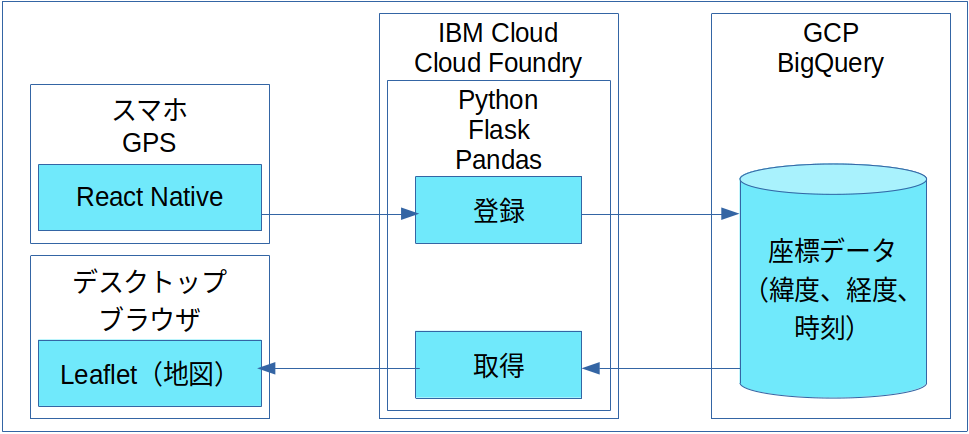

# react-gps-leaflet-map
React-Native, GPS, Flask, Pandas, BigQuery, Leaflet

# システム構成

# やりたいこと
* 今後使いそうな技術を使ってみる  
* 最低限、動作するだけのものを作る  
* 必要な技術を選んで使ってみる  
* クレジットカード無しで、無料であること  

## IBM CLOUD
* 無料、カード無し  ※この条件がなかなか見つからなかった。  
* サーバサイド側としてアプリを配置する  
* 制限として、定期的にデプロイしないと停止してしまう  
* 制限として、割り当てられるメモリがかなり少ない  
* いくつかの言語に対応。Pythonもデプロイ可能  

## GCP
* 無料、カード無し。  
* データを保管するためだけにBigQueryを使う  ※保管日数に制限あり  
* 他の機能を使うには、大体がカード登録が必要となっている  
* 何でもできる=金がかかる  

## AWS
* カード登録が必要。※気をつけないと課金されてしまう  
* 何でもできる=金がかかる  

## Firebase
* サーバレス（Functions）を試してみたけど、カード登録が必要だったから除外  
* 静的コンテンツなら配置可能  
* 確か、独自ドメインも登録可能  
* 認証の仕組みが無料で提供されている  

## GitHub
* 静的コンテンツなら配置可能  

## スマホ
* ReactNativeに挑戦する  
* 何か機能（GPC、加速度、カメラ、マイク、Bluetooth、Wi-Fi）を使いたい  

## データ活用
* 集めたデータを見える化したい  
* 集計、グラフ化  

## ReactNative
* ソースコード：[App.js](App.js)  
* GPSデータを送信する  

## IBM Cloud
* ソースコード：[flaskserver.py](flaskserver.py)  
* GPSデータをBigQueryに保管する  

## Leaflet
* ソースコード：[map.html](map.html)  
* 地図にGPSデータを表示する  
